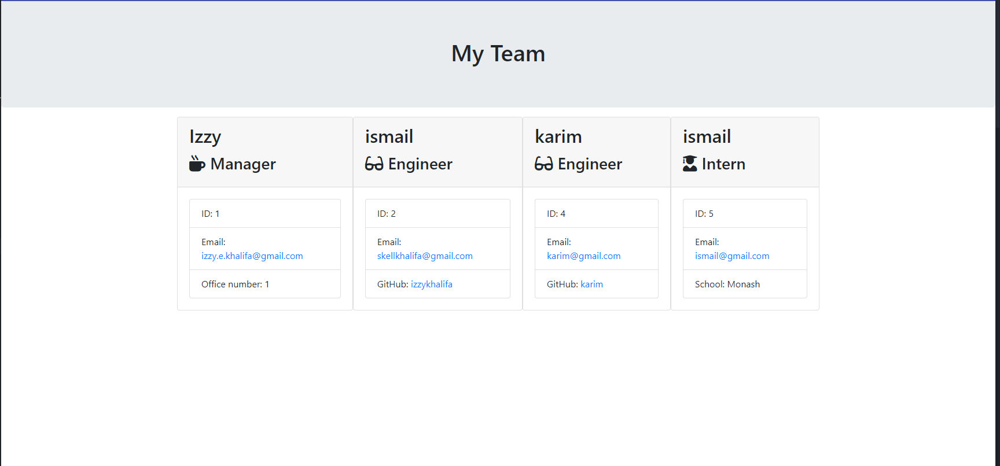

# Team-Profile-Generator

## The App

This is a Node.js command-line application that takes in information about employees on a software engineering team, then generates an HTML webpage that displays summaries for each person. 

Because this Challenge will require the use of the `Inquirer` package, ensure that you install and use Inquirer version 8.2.4. To do so, use the following command in your project folder: `npm i inquirer@8.2.4`.


## User Story

```md
AS A manager
I WANT to generate a webpage that displays my team's basic info
SO THAT I have quick access to their emails and GitHub profiles
```

## Mock-Up

This is a snippet of how the webpage will look like:



The following link shows a video of how to use the app:

https://drive.google.com/file/d/1NnRpHw3pSIB8-ZVKJF9aMmN3TMrgqUMX/view

Run the app using:
```bash
node index.js
```
Runs tests using:
```bash
jest 
```

© 2022 Trilogy Education Services, LLC, a 2U, Inc. brand. Confidential and Proprietary. All Rights Reserved.
